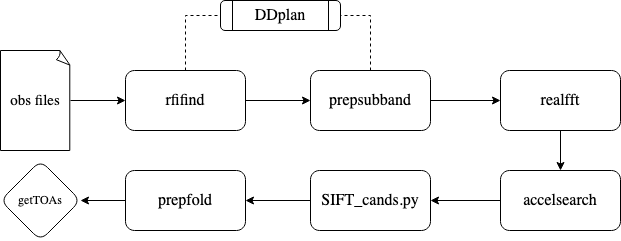

# UWl OzStar Pipeline 

Pipeline created to analyse data collected from Parkes UWL instrument and compute analysis on OzStar. Makes use of PRESTO and Slurm to mass apply for jobs to quickly reduce and accelsearch search mode (.sf) data. 

