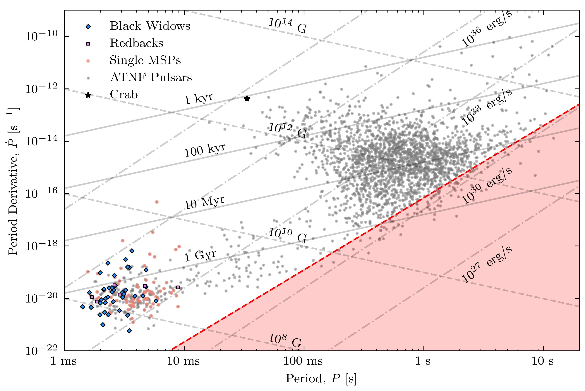

# Phabulous Pulsar Scripts

Scripts of use when analysing the photons from dense fast spinning stars with strong magnetic fields sending particles from this side of the universe to the other. 

--- 

Most of these scripts call other popular pulsar scripts such as `PRESTO`, `TEMPO` and `Riptide`.  
